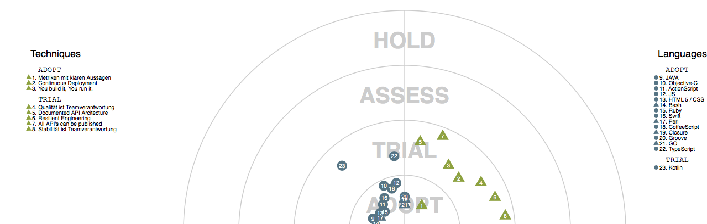

# Tech Radar



The **Tech Radar** is a tool to inspire and support teams to pick the best technologies for new projects. Based on the ideas of [ThoughtWorks](https://www.thoughtworks.com/radar), our Tech Radar sets out the changes in technologies that are interesting in software development: changes that we think our engineering teams should pay attention to and consider using in their projects.

This repository shares:

* the visualization of the Tech Radar, including a short summary of what it includes and how we are using it.

* *code* for generating the Tech Radar visualization from a simple tabular representation (tsv). The visualization code is based on the [Protovis JavaScript visualization library](http://mbostock.github.io/protovis/) and a fork of [Brett Dargan's Tech Radar visualization tool](https://github.com/bdargan/techradar). We've optimized the layout to make the chart and explanations fit on a double-sided sheet of A4 paper.


## 1. How can I see the Tech Radar?

To see the Tech Radar you need to Clone the [Tech Radar Repository](https://github.com/axelspringer/tech-radar.git)
and open the `index.html` in your {YOUR-PROJECT-PATH}/tech-radar/ directory

 
# 2. How can I update the Tech Radar
The Tech Radar retrieves the required data from the simple tabular representation's (.tsv data) 


## 2.1 Requirements

To generate the sources for the Tech Radar, you need to install is `Homebrew/`, `ruby (version <=2.1)` and `liquid`.
If you have Install all skip to 2.2.

###For Mac
#### Install Homebrew
RUN:
````
/usr/bin/ruby -e "$(curl -fsSL https://raw.githubusercontent.com/Homebrew/install/master/install)"
````

####Install ruby
RUN:
````
brew install ruby
````

####Install liquid
RUN:
````
gem install liquid
````


## 2.2 Make a new simple tabular representation
Create a Google doc with the following columns:

* **Technology** (e.g. "Hystrix")
* **Quadrant** (Needs to be exactly and at least one of each quadrants: "Platforms & Infrastructure", "Data Mgt", "Languages", "Techniques; Frameworks & Tools")
* *[optional] Comments (e.g. "lib for fault tolerance")* 
* **Score** as a float between 2.0 and -2.0 (e.g. "1.8")
* *[optional] Number of votes, for internal bookkeeping*
* *[optional] Consensus score, for internal bookkeeping*
* **Skip** &mdash; set to true if entry should not be visualized on chart

Then follow the instructions below.

Note: the score-to-ring mapping we use is not linear:

		score    2 ----- 1.5 --------------- 0 ---------- -1 ---------- -2
	  	 ring      ADOPT          TRIAL          ASSESS         HOLD

## 2.3 Import your simple tabular representation

1. Download your (public) googleDoc
1. rename it to "actuellyear"_"actuellmonth".tsv (e.g. 2017_02.tsv) and move it to the {YOUR-PROJECT-PATH}/tech-radar/data/ directory
1. run `./transform.rb` ({YOUR-PROJECT-PATH}/tech-radar/) to generate a new `radar_data.js`
1. open `index.html` ({YOUR-PROJECT-PATH}/tech-radar/) in your browser to inspect the result
1. repeat the last two steps until you're happy with the arrangement :)
1. check everything in

Note: the last `.tsv` file (by lexical order) in `data/` is visualized. The next-to-last `.tsv` file (if it exists) is used to find out which blips have moved, relative to the previous radar.


# License
Apache 2.0 &mdash; same as [bdargan/techradar](https://github.com/bdargan/techradar)
